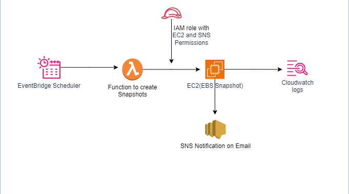

# Automated-EBS-Snapshot-Backup-using-AWS-Lambda-SNS
## Description:
  Automatically creates EBS snapshots for EC2 instances (including Auto Scaling Group instances) and sends notifications via SNS. CloudWatch monitors Lambda execution, and IAM Roles & Policies manage permissions.
## Contents:
1. Requirements

2. Architecture

3. Setup Instructions
 - Create SNS Topic
-  Create IAM Role for Lambda
-  Create Lambda Function
 - Add Lambda Function Code
-  Configure CloudWatch Event

4. Testing

5. Screenshot
## Requirements

- AWS Account

- AWS Services used:

   -  EC2

  - Auto Scaling Group (ASG)

  - Lambda (Python 3.12)

   - SNS

    - CloudWatch

    - IAM Roles & Policies
- IAM Permissions for Lambda:

  - AWSLambdaBasicExecutionRole

   - EC2: DescribeInstances, DescribeVolumes, CreateSnapshot, DeleteSnapshot

    - SNS: Publish

    

   #### Components

1. Amazon EventBridge (or CloudWatch Events) – Triggers the Lambda function on a schedule (e.g., daily at midnight).

2. AWS Lambda Function – Executes snapshot creation logic using the AWS SDK (Boto3 for Python).

3. Amazon EC2 (EBS Volumes) – The volumes you want to back up.

4. Amazon CloudWatch Logs – Stores execution logs from Lambda.

5. AWS Identity and Access Management (IAM) – Grants Lambda the permissions to create and delete snapshots.

6. Amazon SNS (optional) – Sends notifications on success/failure.
## Service Used
AWS EC2 AWS Auto Scaling Group AWS Lambda (Python 3.12) Amazon SNS Amazon CloudWatch (for monitoring) IAM Roles and Policies Policies
## Features
 - Automated snapshot creation for ASG instances
-  Email notification after backup completion
-  Event-driven backup (no cron/schedule needed)
 - Scalable and cost-efficient
-  Optional cleanup logic for old snapshots
## Implementation Steps:
### Step 1: Create Launch Template
Define AMI, instance type, key pair, and security group. Add a tag: Key: Project Value: EBSBackupASG

### Step 2: Create Auto Scaling Group (ASG)

Use the launch template created above. Configure desired capacity, subnets, and scaling policies. Add Lifecycle Hooks: BackupOnLaunch (for instance launch events) CleanupOnTerminate (optional for deleting old snapshots)

### step 3: Create SNS Topic

Create a topic named: ebs-snapshot-notification Add an Email Subscription and confirm it from your inbox.

### Step 4: Create IAM Role for Lambda
Attach these policies to the role:

AmazonEC2FullAccess AmazonSNSFullAccess CloudWatchLogsFullAccess

Name the role: LambdaEBSBackupASGRole

### Step 5: Create Lambda Function
Name: ASG_EBS_Backup Runtime: Python 3.12 Role: LambdaEBSBackupASGRole Environment Variable: SNS_TOPIC_ARN = your SNS topic ARN

### Step 6: Connect ASG with Lambda
Go to Auto Scaling Group → Lifecycle Hooks Edit BackupOnLaunch: Notification Target: SNS Topic Lambda Trigger: ASG_EBS_Backup

Repeat the same for CleanupOnTerminate if needed.

### Step 7: Test
Scale up the Auto Scaling Group. When a new instance launches: Lambda will trigger automatically. EBS snapshots will be created. An email notification will be sent to your SNS subscriber.

###  Output
Snapshots appear in EC2 → Snapshots

Email notification from SNS showing snapshot IDs

